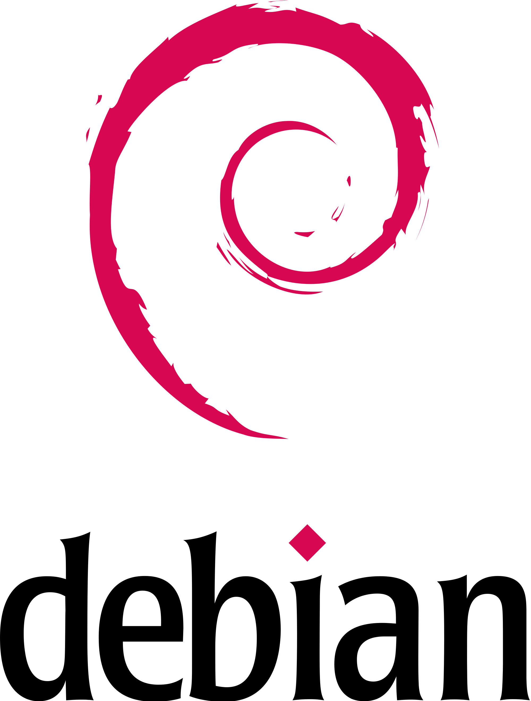

Here are the scripts for building base images which are used for all services from the MMB project. 

## Getting started

    

To build [Alpine 3.7](https://alpinelinux.org/posts/Alpine-3.7.0-released.html) base image run `create_alpine_chroot.sh` with superuser privileges. Once the script is finished, the image `cusdeb/alpine3.7:armhf` is created.

    

To build [Debian Stretch](https://wiki.debian.org/DebianStretch) base image run `create_debian_chroot.sh` with superuser privileges. Once the script is finished, the image `cusdeb/stretch:armhf` is created.

Both `create_alpine_chroot.sh` and `create_debian_chroot.sh` support the following options.

##### `-a`, `--arch`

Allows specifying the architecture of the base image. If not specified, the default `armhf` architecture will be used.

##### `-f`, `--flavour`

Allows specifying the flavour of the base images. If not specified, none of the flavours will be used.

The flavours are located in the `flavours` directory.

##### `-t`, `--tag-name`

Allows changing used by default tag name for the base image.

## Differences from other similar Docker Hub images

The images created by `create_alpine_chroot.sh` and `create_debian_chroot.sh` include `qemu-arm-static` 2.11 to simplify debugging on x86 machines. Furthermore, Debian Stretch base image:
* is forced to get rid of configuration files when removing packages;
* drops locales and man pages when installing packages.

These two things help keep images as small as possible.
