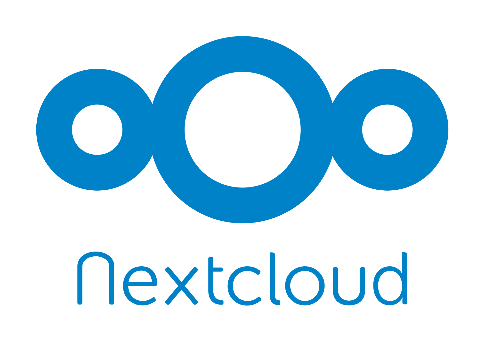

# Nextcloud

    

Nextcloud is a self-hosted collaboration platform which can act as an alternative to [Google Workspace](https://workspace.google.com/) and [Microsoft 365](https://microsoft.com/en-ww/microsoft-365).

<table>
  <tr>
    <td align="center" colspan="2"><b>Nextcloud</b></td>
  </tr>
  <tr>
    <td>Version</td>
    <td><a href="https://github.com/nextcloud/server/releases/tag/v31.0.14">31.0.14</a></td>
  </tr>
  <tr>
    <td>Release date</td>
    <td>12 Feb 2026</td>
  </tr>
  <tr>
    <td>Port</td>
    <td>8001</td>
  </tr>
  <tr>
    <td valign="top">Base image</td>
    <td><a href="https://hub.docker.com/_/alpine">The official Docker image</a> based on <a href="https://alpinelinux.org/posts/Alpine-3.21.0-released.html">Alpine 3.21</a></td>
  </tr>
</table>

## Features

* Nginx [1.26.3](https://nginx.org/en/CHANGES-1.26) and PHP [8.3.19](https://php.net/ChangeLog-8.php#PHP_8_3).
* The [Bookmarks](https://github.com/nextcloud/bookmarks) application allows users to collect and organize bookmarks.
* The [Calendar](https://github.com/nextcloud/calendar) and [Contacts](https://github.com/nextcloud/contacts) applications allow users to synchronize calendars and contacts with the server respectively.
* The [Circles](https://github.com/nextcloud/circles) allows users to create their own groups of users/colleagues/friends. Those groups of users (or circles) can then be used by any other app (for example, [Collectives](https://github.com/nextcloud/collectives)) for sharing purpose through the Circles API.
* The [Collectives](https://github.com/nextcloud/collectives) allows users to to build shared knowledge.
* The [Deck](https://github.com/nextcloud/deck) application allows users to organize their work using [Kanban](https://en.wikipedia.org/wiki/Kanban_(development)) style dashboard.
* The [Files viewer](https://github.com/nextcloud/viewer) application allows users to view their photos and videos.
* The [News](https://github.com/nextcloud/news) application allows users to collect RSS/Atom feeds for later viewing.
* The [News Updater](https://github.com/nextcloud/news-updater) microservice allows users to speed up fetching of RSS/Atom feed updates.
* The [Notes](https://github.com/nextcloud/notes) application allows users to make notes. It also provides categories for better organization and supports [Markdown](https://en.wikipedia.org/wiki/Markdown).
* The [Notifications](https://github.com/nextcloud/notifications) application provides a backend and frontend for the notification API available in Nextcloud. The API is used by other applications to notify users in the web UI and sync clients about various things.
* The [Passman](https://github.com/nextcloud/passman) application allows users to manage their passwords and share them with other users.
* The [Passwords](https://git.mdns.eu/nextcloud/passwords) application allows users to store, generate and manage their passwords with client-side encryption.
* The [PDF viewer](https://github.com/nextcloud/files_pdfviewer) application allows users to view PDF files. It uses the [PDF.js](https://mozilla.github.io/pdf.js/) library under the hood.
* The [Photos](https://github.com/nextcloud/photos) application allows users to create albums from their contents, favorite and tag their photos, show slideshows and share their photos or albums with other users.
* The [Photo Sphere Viewer](https://github.com/nextcloud/files_photospheres) application allows users to view Google PhotoSphere 360° images.
* The [Talk](https://github.com/nextcloud/spreed) application allows users to have private, group, public and password protected calls. It uses the [simpleWebRTC](https://simplewebrtc.com) library under the hood. Calls are served by a bundled [High Performance Backend](#talk-high-performance-backend) (external signaling server + NATS message bus + TURN) so group calls stay reliable and work behind NAT.
* The [Text](https://github.com/nextcloud/text) allows users to collaborate on documents using [Markdown](https://en.wikipedia.org/wiki/Markdown).

## Installation

Read the [Getting Started](https://github.com/tolstoyevsky/mmb#getting-started) section to learn how to install this or other services.

## Configuration

`docker-compose.yml` supports the following parameters.

| Parameter | Description | Default |
| --- | --- | --- |
| PORT                 | The port the web server listens on                                                                   | 8001 |
| PM_MAX_CHILDREN      | [pm.max_children](https://php.net/manual/en/install.fpm.configuration.php#pm.max-children)           | 5    |
| PM_START_SERVERS     | [pm.start_servers](https://php.net/manual/en/install.fpm.configuration.php#pm.start-servers)         | 2    |
| PM_MIN_SPARE_SERVERS | [pm.min_spare_servers](https://php.net/manual/en/install.fpm.configuration.php#pm.min-spare-servers) | 1    |
| PM_MAX_SPARE_SERVERS | [pm.max_spare_servers](https://php.net/manual/en/install.fpm.configuration.php#pm.max-spare-servers) | 3    |
| SIGNALING_URL        | Public `.../standalone-signaling/` URL Talk hands to clients (must be reachable from the browsers and from the stack). Empty = signaling not registered. | *(empty)* |
| SIGNALING_SECRET     | Shared secret between Nextcloud and the signaling server                                             | secret |
| SIGNALING_HASHKEY    | Key signing signaling session tokens (32 or 64 bytes). Required to be equal across multiple signaling instances | *(random per start)* |
| SIGNALING_BLOCKKEY   | Key encrypting signaling session tokens (16, 24 or 32 bytes). Same multi-instance rule as SIGNALING_HASHKEY | *(random per start)* |
| SIGNALING_VERIFY     | Set to any value to pass `--verify` when registering the signaling server (valid TLS)                | *(empty)* |
| SIGNALING_SKIP_VERIFY| `true` lets the signaling server talk to a Nextcloud with an untrusted (e.g. self-signed) certificate | *(empty)* |
| TURN_SERVER          | Public `host:port` of the TURN server (coturn). Empty = TURN not registered                          | *(empty)* |
| TURN_SECRET          | Shared secret for TURN REST credentials (must match coturn `AUTH_SECRET`)                            | secret |
| STUN_SERVER          | Public `host:port` of the STUN server. Empty = STUN not registered                                   | *(empty)* |

In order to calculate the values of `PM_MAX_CHILDREN`, `PM_START_SERVERS`, `PM_MIN_SPARE_SERVERS` and `PM_MAX_SPARE_SERVERS` that fit your needs, use [PHP-FPM Process Calculator](https://spot13.com/pmcalculator/).

## Talk High Performance Backend

Talk ships with its High Performance Backend (HPB) so that group calls scale and
traverse NAT. It is delivered by four extra services in `docker-compose.yml`:
`coturn` runs from its own image, while `signaling`, `nats` and `talk_provision`
are the shared Nextcloud image started with different `TYPE` values:

* `signaling` (`TYPE=signaling`): the [nextcloud-spreed-signaling](https://github.com/strukturag/nextcloud-spreed-signaling) server, reverse-proxied by the frontend at `/standalone-signaling/`.
* `nats` (`TYPE=nats`): the [NATS](https://nats.io/) message bus the signaling server uses to exchange events asynchronously.
* `coturn`: the TURN/STUN server, authenticating clients with time-limited REST credentials derived from a shared secret.
* `talk_provision` (`TYPE=talk_provision`): a one-shot service that waits until Nextcloud is installed and then idempotently enables Talk and registers the signaling/TURN/STUN servers from the variables above. It is safe to leave in place; it re-runs on every `up` and only adds what is missing.

After the first `docker-compose up`, install Nextcloud through the web installer
as usual; `talk_provision` finishes the Talk wiring on its own once the instance
is up. Set `SIGNALING_URL`, `TURN_SERVER` and `STUN_SERVER` to hosts that are
reachable both from users' browsers and from within the stack, and change
`SIGNALING_SECRET`/`TURN_SECRET` from their defaults before going to production.
